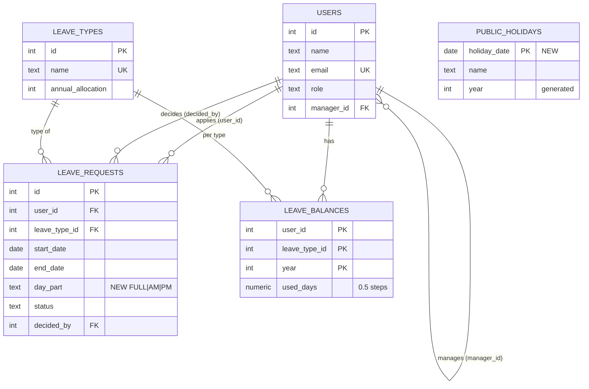

# Capstone — mini design doc: half-day leave and public holidays

**Stories:** [`stories.md`](stories.md) US-17…US-21 (approved by Nadeesha). **Status:** accepted. **Date:** 2026-09-22.

## 1. Problem

Leave is counted in whole days, and public holidays are a hard-coded list in `server/src/lib/holidays.js`, so HR can't
change it. Nadeesha wants morning/afternoon half days that cost 0.5, and a holiday calendar, maintained by HR, that is
never charged.

## 2. Storing half days: `day_part` vs a `half_day` boolean

**Decision: add `day_part TEXT NOT NULL DEFAULT 'FULL' CHECK (day_part IN ('FULL','AM','PM'))` to
`leave_requests`. It describes the request's last day** (OQ-1): FULL = whole day, AM = off that morning, PM = off that
afternoon. Existing rows become FULL, so nothing changes for them.

| | `day_part` FULL / AM / PM | `half_day` boolean |
|---|---|---|
| Which half? | Stored (AM or PM). The manager's card can show "AM"/"PM" (AC-18.6) | Not stored; a second column (`half_day_part`) is needed anyway, so we end up with two columns and an invalid combination (`false` + `'PM'`) |
| Multi-day requests | One rule: the part applies to the last day. Mon–Wed + AM = 2.5 | `true` on a 3-day request is ambiguous: which day is half? |
| Balance math | `days = working days − (last day is a working day and part ≠ FULL ? 0.5 : 0)`: one place, one rule | Same subtraction, but it can't say *which* half, so two half days on the same date (AM + PM, AC-17.4) can't be told apart from a clash |
| Overlap rule | AM and PM on the same date are compatible; FULL clashes with both | Can't tell AM from PM, so two half days on one date would clash |
| API shape | `"day_part": "AM"` — self-describing, and adding e.g. `'HOURS'` later is a CHECK change | `"half_day": true` plus something else to say which half |

The boolean loses on every row: it can't say which half, so it fails AC-17.4 and AC-18.6.
**Rejected alternative 2:** `start_part` + `end_part` columns would allow a half day at both ends of one request.
That's more than Nadeesha asked for; it's parked as a backlog issue (book the first half day separately).

## 3. Day math

`leaveDays(start, end, holidays, dayPart = 'FULL')` stays a pure function. It counts weekdays that are not holidays,
then subtracts 0.5 if `dayPart` is AM/PM **and** the last day is a working day. A half day on a poya or weekend is
therefore 0 and is refused (AC-20.3). `used_days` is already `NUMERIC(4,1)`, so 0.5 needs no type change. Balances,
approvals, the manager card, history and CSV all call this one function with the request's `day_part`.

## 4. `public_holidays` table

```sql
CREATE TABLE public_holidays (
  holiday_date DATE PRIMARY KEY,
  name         TEXT NOT NULL,
  year         INTEGER GENERATED ALWAYS AS (EXTRACT(YEAR FROM holiday_date)::int) STORED,
  note         TEXT,          -- e.g. 'to confirm against the official gazette' on the seeded rows
  created_at   TIMESTAMPTZ NOT NULL DEFAULT now()
);
CREATE INDEX public_holidays_year ON public_holidays (year);
```

**Primary key = `holiday_date`.** For day counting, a date either is or isn't a holiday. Two holidays on one date
(Vesak + Labour Day on 1 May 2026) are one row with both names (AC-19.2). A date key makes duplicates impossible:
nothing can double-subtract and there are no "which row wins" questions.
- A surrogate `id` would allow two rows for one date.
- `(date, name)` would count 1 May twice unless every query adds `DISTINCT`.

`year` is **generated** from the date: it can't disagree with the date, and HR lists a year with `WHERE year = $1`.
Corrections (a moved Islamic holiday) are a delete plus an add, which also triggers the re-credit rule below.

**Seed:** migration 006 inserts the 25 dates of the 2026 list from `holidays.js`, each noted *to confirm against the
official gazette*. `holidays.js` is deleted; the API reads the table.

**Changing the list (OQ-4):**
- **Add a holiday:** in one transaction, insert the row, then for every APPROVED request covering the date,
  recompute its days with and without the holiday and subtract the difference from `used_days`. The response lists
  the adjusted requests.
- **Delete a holiday:** delete the row and change no `used_days`. The response lists the approved requests covering
  the date (not re-charged).
- Pending requests are always counted with the current list.

## 5. Migration and down path

`006_half_day_and_holidays.sql` (up):
- adds `day_part` with its default and CHECK;
- creates `public_holidays` and the index;
- seeds the 2026 holidays.

It is applied through the existing `schema_migrations` runner. **Tested on a fresh database (2026-09-22):**
- `applied 001…006` in 526 ms; a second run applied nothing; 25 holidays for 2026; 5 existing requests became `FULL`.
- The down path removed the table, the column and the ledger row; `migrate` then re-applied 006.
- With one half day present, the down path refused (`half-day requests exist: restore from backup or fix forward
  instead`) and changed nothing.
- The throwaway database was dropped afterwards.

**Down path** (`server/src/db/down/006_half_day_and_holidays.down.sql`, run by hand, not by the runner):

```sql
BEGIN;
-- refuse if any half day exists: dropping day_part would silently turn 0.5 into 1.0
DO $$ BEGIN
  IF EXISTS (SELECT 1 FROM leave_requests WHERE day_part <> 'FULL') THEN
    RAISE EXCEPTION 'half-day requests exist: restore from backup or fix forward instead';
  END IF;
END $$;
DROP TABLE public_holidays;
ALTER TABLE leave_requests DROP COLUMN day_part;
DELETE FROM schema_migrations WHERE filename = '006_half_day_and_holidays.sql';
COMMIT;
```

The down path is only clean while no half day exists. After that, **rollback means restore** from the pre-migration
backup, or fix forward, because `used_days` already holds 0.5 values the old code can't explain. Holidays added by HR
are lost on rollback; export them first.

## 6. API contract diff

```diff
 POST /api/leave-requests
   request:  { leave_type_id, start_date, end_date, reason }
+  request:  day_part?: "FULL" | "AM" | "PM"          (default "FULL"; AM/PM only for Annual and Casual)
+  400 VALIDATION_ERROR "day_part: must be FULL, AM or PM" · "Half days are for Annual or Casual leave"
+  400 VALIDATION_ERROR "2026-05-01 is Vesak Full Moon Poya Day — no leave needed" (0 working days, on a holiday)
   201: { id, …, start_date, end_date, status }
+  201: day_part
   409 OVERLAPPING_REQUEST — AM and PM on the same date no longer clash

 GET /api/balances
   [{ id, name, annual_allocation, used_days, pending_days, remaining_days }]
~  used_days / pending_days / remaining_days may be halves (13.5); pending counts holidays and day_part

 GET /api/leave-requests, /api/team/requests (+ ?history, ?from&to), /reports/leave-requests.csv
+  day_part on every row; days counts holidays from the table and the half day; CSV gains a "Day part" column

+GET    /api/holidays?year=2026      HR_ADMIN → 200 [{ date, name, year }]           others 403
+POST   /api/holidays {date, name}   HR_ADMIN → 201 { holiday, adjusted: [requests] } 409 HOLIDAY_EXISTS · 400 · 403
+DELETE /api/holidays/:date          HR_ADMIN → 200 { deleted, not_recharged: [requests] } 404 · 403
```

## 7. ERD (after the change)



`public_holidays` has no foreign keys: day counting joins it by date range, not by key.

## 8. Risks

- The 2026 dates are a starting list; HR confirms them against the gazette (flagged on the Holidays screen).
- The client's live preview on the Apply form doesn't know holidays; the server's count is authoritative and is shown
  once the request is saved (known issue, unchanged).
